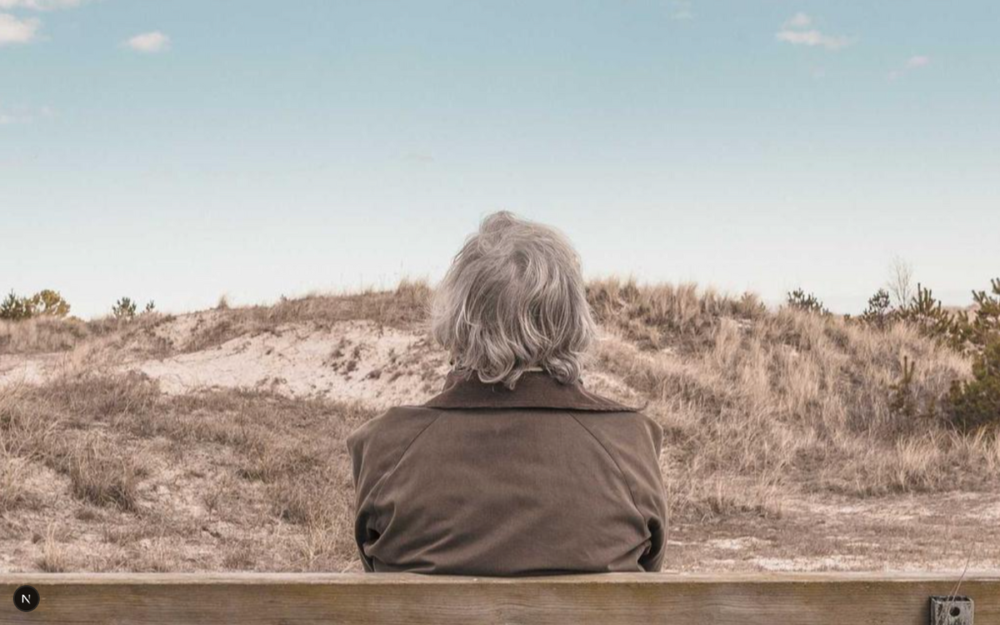
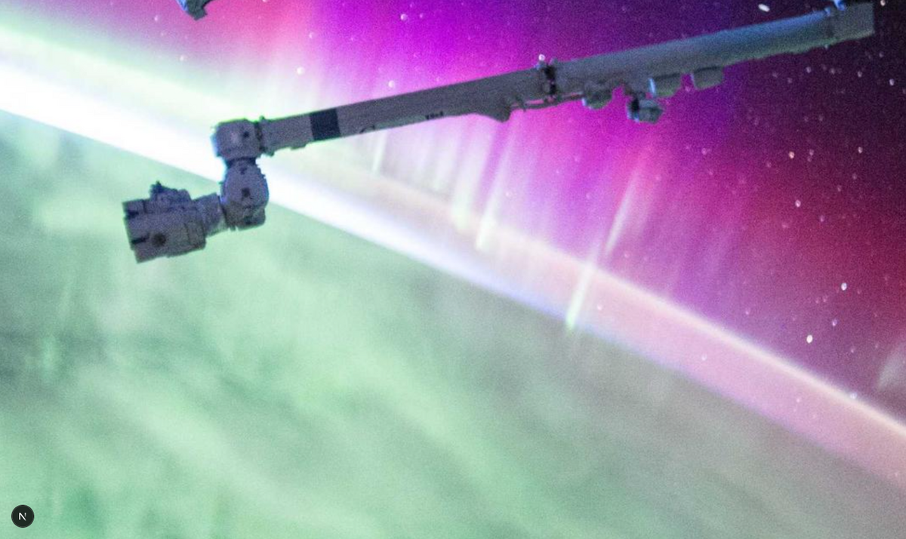
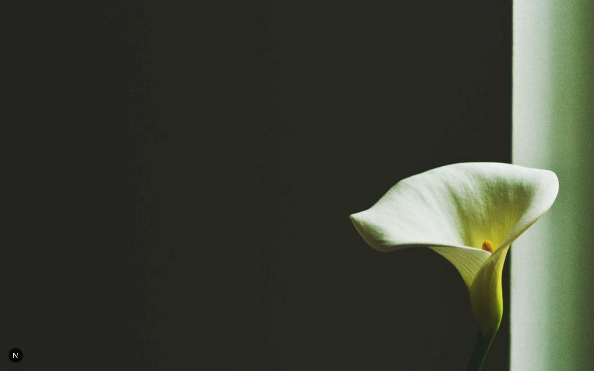
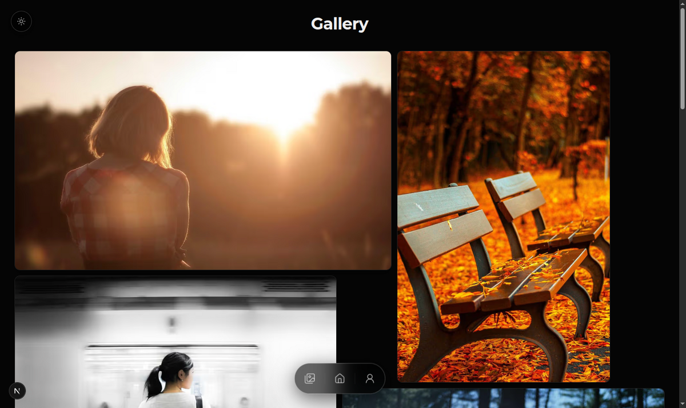
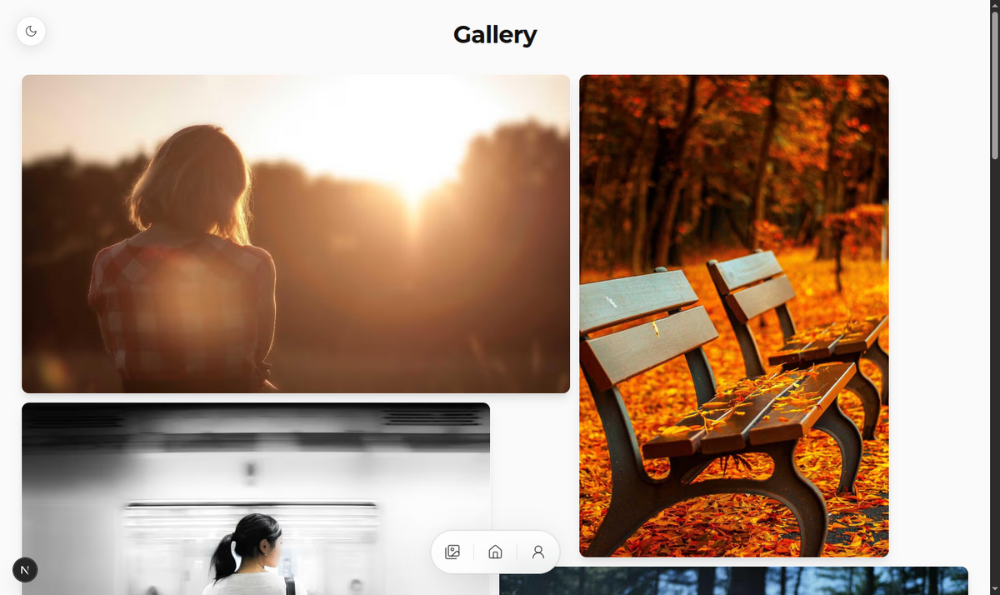
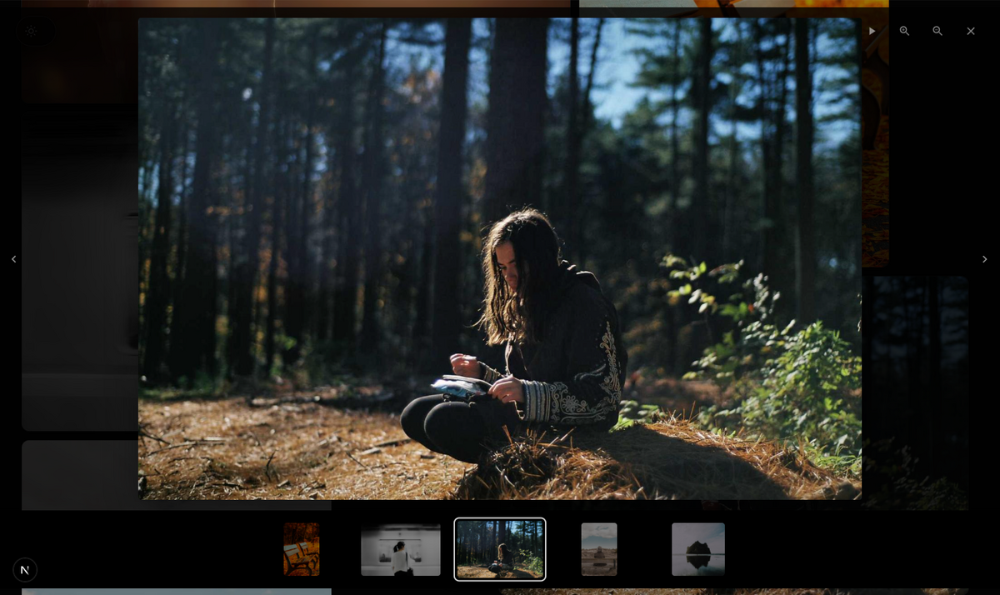
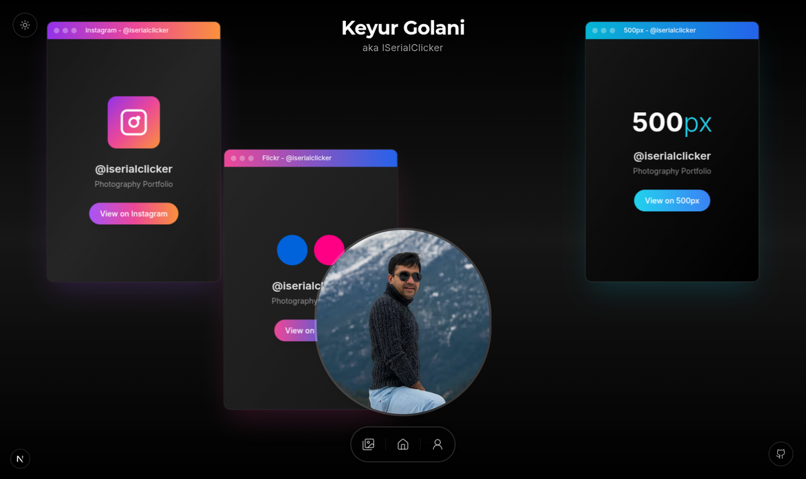

# 📸 Showcase — Photography Portfolio

A visual tour of the photography portfolio: an immersive, glassmorphism-styled Next.js 16 site with a full-bleed hero carousel, a masonry gallery, a feature-rich lightbox, and seamless dark/light theming.

> _Gallery images shown below are representative samples used to demonstrate the layout, lazy-loading, and lightbox behavior._

---

## 🏠 Home — Immersive Hero Carousel

The landing experience is a full-viewport, auto-advancing hero carousel that cycles through featured photography. The UI is context-aware and auto-hides for a clean, immersive view, revealing navigation and controls on interaction. A parallax profile composition sits over the carousel.

**Dark theme**

**Light theme**

**Carousel transition** — smooth Framer Motion cross-fades between slides with previous/next controls.

---

## 🖼️ Gallery — Masonry Grid

The gallery uses a dynamic masonry grid (best-fit placement across breakpoints) with IntersectionObserver-based lazy loading, low-quality image placeholders (LQIP), and a blur-up reveal as full-resolution images stream in. Next.js Image optimization negotiates AVIF/WebP automatically.

**Dark theme**

**Light theme**

---

## 🔍 Lightbox Viewer

Clicking any photo opens a full-featured lightbox with zoom, slideshow, keyboard navigation, and a thumbnail filmstrip for quick jumping between images.

---

## 👤 About — Identity & Social Profiles

The About page presents the photographer's identity with an animated profile composition and glassmorphism cards linking out to Instagram, 500px, and Flickr — each styled to match the platform's brand.

---

## ✨ Highlights at a Glance

| Capability | Detail |
|------------|--------|
| **Framework** | Next.js 16 (App Router, Turbopack) + TypeScript |
| **Design** | Glassmorphism UI, backdrop blur, Framer Motion animations |
| **Theming** | Dark/light with system-preference detection, persisted choice |
| **Gallery** | Masonry layout, lazy loading, LQIP blur-up placeholders |
| **Lightbox** | Zoom, slideshow, thumbnails, keyboard navigation |
| **Images** | Sharp pipeline (400/800/1920px), AVIF/WebP, EXIF captions |
| **Performance** | ISR caching, on-demand resizing with disk cache |
| **Deployment** | Docker-ready, background image watcher |

---

_See the [README](README.md) for setup and configuration. Screenshots generated from a local development build._
